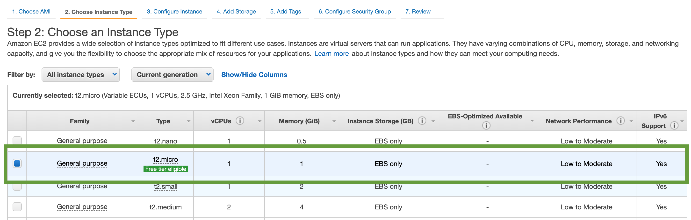

# Configuracion de interprete remoto para python

Sigue los pasos descritos  a continuacion para tener 
una forma exitosa de tu interprete remoto.

## disclaimer:

_se debe aclarar que este tipo de configuracion solo funciona
con pycharm profesional, ademas de poseer una cuenta en amazon web service
que te permita crear instancias de computo._

___

- Paso 1 : crear una instancia de computo en tu proveedor favorito (digital ocean
, amazon web services, azure, ibm bluemix, etc...) para este ejemplo usaremos
la guia de como crear instancias sobre amazon web service.

- Paso 2: en el boton azul, podemos presionar para lanzar una nueva instancia (launch instance)

una vez presionamos el boton, veremos una lista como la siguiente:

como pueden ver en la imagen, se recomienda usar una base de una imagen linux, esto para
no estar preparando el ambiente luego, ya que de forma nativa ubuntu posee python en su version 3.6.5.

una vez seleccionas esa imagen seguiremos con la configuracion mas basica de una instancia de computo.

- Paso 3: lo primero, sera seleccionar el tipo de instancia

_como recomendacion, selecciona la que esta marcada, ya que pertenece al grupo que 
ofrece este proveedor de computo como parte de su capa gratuita, esto signfica
que podras disfrutar mes a mes un total de 730 horas de computo libres de costos para ti.
este beneficio solo se extiende para cuentas nuevas y tiene caducidad de 1 año._

- Paso 4: configurar la instancia de computo, este paso puede ser casi un click, ya que si
tienes poco o nulo conocimientos con servidores y redes, te recomiendo dejar todo tal
como esta y darle siguiente, de todas formas en la siguiente imagen podras ver un ejemplo de
este paso.

- Paso 5: una vez les das a siguiente en la pantalla de configuracion de la red para esta
instancia, debes indicar cuanto disco duro vas a ocupar para esta instancia. recuerda
que estas levantando un servidor para tu interprete, este debe posee, procesamiento, almacenamiento
y conexion. de momento solo hemos seleccionado tipo de procesamiento y conexion.

recomiendo dejar la instancia en 8gb con un disco SSD, suficiente espacio para el interprete y tus proyectos
y un buen disco para leer mas rapido.

como aparece en la misma imagen, el almacenamiento tambien esta dentro de la capa grauita y tiene un limite de 30gb.
recuerda que este proveedor de computo tiene tarificacion bajo demanda, esto significa que pagas por lo que consumes.
como este disco esta dentro de la capa gratuita, no tendras que pagar si tu cuenta es nueva o tiene menos de 1 año de
funcionamiento.

- Paso 6: en la siguiente vista, la instancia de computo te permitira agregar tag,
son utiles cuando tienes cluster de maquinas y quieres referencia la maquina desde la cuenta de aws
o bien los puedes usar como un diccionario de la maquina para almanecar informacion relevante,
como el tipo de maquina, que es lo que vas a desplegar en ella, etc. no es mandatorio indicar, tags
asi que para este ejemplo nos saltaremos este paso

- Paso 7: ya en ultimo lugar, solo necesitamos terminar de agregar una regla de red
importante para que nuestro interprete remoto funcione.

el siguiente paso muestra que debemos configurar un grupo de red, que quiere decir esto,
es basicamente indicarle al servidor que abra un puerto o varios puertos en especificos.

estos puertos se usan de forma comun para crear canales de comunicacion con los servidores,
existen ciertos puertos que se usan casi como un estandar en el mercado para determinar su uso epsecifico
para algun tipo de protocolo, en este caso, el protocolo que usaremos para crear nuestro inteprete remoto
sera SSH, y en particular y de forma casi globalizada, se recomienda usar el puerto 22 para este tipo de conexion.

esta convencion no tiene nada especial, es solo una convencion, podriamos usar cualquier puerto, pero nos guiaremos
por el estandar para configurar nuestro servidor.

esta es casi una regla por defecto para un grupo de red nuevo dentro de aws, solo 
tendrian que cambiar el titulo y descripcion de las reglas de red.

el mensaje de advertencia esta dado ya que le estamos indicando a la instancia que va a poder recibir
conexiones desde cualquier ip, esto signfica que queda abierta al mundo, siempre y cuando la persona
que se quiere conectar tenga las credenciales y la ip de la maquina. asi que recuerden esto a futuro si
es que desean prestar su acceso a su instancia, ya que podria usarse con otros fines.

- Paso 8: revisar que todo este en orden para lanzar la instancia de computo. es aqui donde deben revisar todos
los detalles de la maquina: tipo de instancia que va a aprovisionar, cantidad de almacenamiento, reglas de conexion, etc

como aparece en la imagen, el mensaje es bien claro, su maquina quedara abierta al mundo.

- Paso 9: cuando indicamos que debemos conectarnos por ssh a nuestra maquina, amazon nos pide
un ultimo paso, dar un acceso seguro a esta maquina, a traves de un proceso bastante sencillo

en esta imagen se puede apreciar rapidamente como crearemos una nueva clave para nuestra instancia.
a diferencia de una clave convencional como la que usas en cualquier cuenta de una red social, esta clave
la genera amazon y te la entrega una unica vez, que seria en este paso, a traves de un fichero con una extension
.pem (Privacy Enhanced Mail), para entender mejor esto, es casi como un certificado unico
que utilizas cada vez que te quieras conectar a tu instancia, si alguien intenta entrar por el puerto 22 a tu instancia
y no tiene esta pem, no podra acceder, por eso es importante que cuides este fichero, ya que es tu clave.

si lo pierdes, lo mas probable que amazon no te lo entrege nuevamente y tengas destruir tu actual
instancia e computo y crear una nueva. recuerda que este certificado, solo te lo entregan en este paso, por lo cual
debes reguardar una vez lo bajas. en general estos certificados se pueden compartir entre instancias, practica que no te recomiendo
si deseas trabajar con mas de un inteprete remoto.

para bajar el ceritifcado solo, selecciona "Create new key pair" y luego dale al boton "download key pair" y finalmente
a launch instance.

finalmente veras una imagen como esta:

- Paso 10: ya que tenemos la instancia creada, buscaremos cual es su ip

como podemos apreciar, volvimos a la primera vista donde se encuentrar nuestras instancias
, y de acuerdo a la imagen podemos encontrar la ip de la maquina que queremos seleccionar.

solo debemos copiar esa ip para seguir con la configuracion de pycharm.

- Paso 11: recuerda que en muchas ocasiones, las imagenes para nuevas instancias en amazon, no estan
actualizadas e incluso puede que en mucho casos no exista el inteprete de python.

por lo cual te recomiendo conectarte a la instancia de computo por comando ssh usando tu ip y tu pem.

este comando debe ser ejeuctado situandote donde esta tu pem, ya que el "-i" le esta indicando
que usara ese fichero como pem de acceso. puedes utilizar muchos clientes para hacer esto tales como PuTTY
para windows. en mac te recomiende usar directamente el cli nativo.

una vez dentro de la instancia solo tendras que realizar la instalacion de python como lo acostumbras a hacer bajo
cualquier sistema unix

primero asegurate de que todas las dependencias este actualizadas usando los siguientes comandos

`apt update` y luego `apt upgrade`

luego para instalar python, solo debes ejecutar:

`apt install python`

si requieres python 3

`apt install python3`

con estos simples pasos te aseguras de tener disponible python en tu instancia de computo.

- Paso 12: configuramos un nuevo acceso remoto para nuestra instancia a traves de pycharm

una vez dentro podremos ver una barra lateral donde nos mostraran
la lista de "Remote host" que tenemos disponibles. debes crear
uno nuevo presionando el boton que tiene "..." al costado de la lista.

podremos en la parte superiro un boton "+", este nos permitira
agregar un nuevo acceso remoto.

cuando presionemos el boton, podremos ver una listab de diferentes
tipos de acceso a nuestra instancia, seleccionaremos  "SFTP"

nos pedira un nombre, podemos usar el que estimemos conveniente

una vez listado, podemos comenzar a configurar nuestro acceso remoto con la ip
y la pem que obtuvimos desde amazon.

recuerda, que la pem de acceso debes tenerla guardada en algun lugar seguro
esa sera tu llave. tal como aparece en la imagen, el tipo de autenticacion sera "Key pair"

luego de entregar la ip, el nombre de usuario que para este caso seria "ubuntu" y la pem, 
podremos validar la conexion, presionando en "Test connection"

este paso no mostrara un mensaje si es la primera vez que nos intentamos conectar,
este mensaje habla acerca que si quieres aceptar este servidor como una instancia conocida.
es necesario este paso para que tu equipo sepa que se puede conectar a este servidor y que no es 
una instancia desconocida.

luego de este proceso, nos mostrara un mensaje como el siguiente.

Esto significa que nuestro IDE ya tiene la capacidad de conectarse a la instancia de computo.

- Paso 13: una vez configurado nuestro "remote host" procederemos a conectar nuestro interprete remoto.

abriremos nuestra configuracion del IDE, una vez en ese lugar buscaremos la siguiente opcion.

presionamos en la busqueda de interpretes, y buscamos la opcion "show all"

podremos ver la lista de interpretes que esta usando el IDE, justo abajo, aparece
un boton con el icono "+"

una vez que presionamos el boton mas, veremos una serie de opciones, pero debemos
seleccionar "SSH interpreter"

en este proceso, seleccionaremos la opcion "Exisiting Server Configuration"

y seleccionaremos de la lista el que habiamos creado en el paso anterior.

el IDE nos preguntara si queremos mover la configuracion de nuestro acceso remoto o hacer una copia
para que no tengan problemas en el futuro, les recomiendo moverla al uso del inteprete. presionando en el boton "Move"

una vez seleccionemos esto, veremos que estamos listo para avanzar en los ultimos pasos de nuestro interprete remoto.

una vez presionamos next, solo no indicara que inteprete de nuestra instancia ocupara
y como va a mapear nuestro proyecto hacia nuestra instancia, en sencillas palabras, es casi
como hacer un espejo de nuestro proyecto y asi utilizar el interprete de la maquina. el IDE se preocupara
de mantener sincronizado el proyecto, y cada vez que necesitemos ejecutar nuestro codigo el previmente
validara que este todo sincronizado.

podras ver que tu nuevo interprete remoto esta listo para ser usado en la lista de interpretes disponibles

bajo esto, ten presente, que vas a necesitar acceso a internet de forma constante, en caso contrario el IDE
no podra llegar a ejecutar tu codigo en la instancia.

todo el log de salida de la maquina, lo captura el IDE y te lo muestra como siempre.

